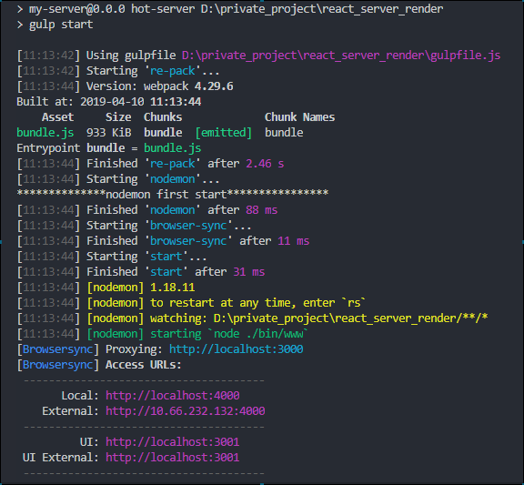
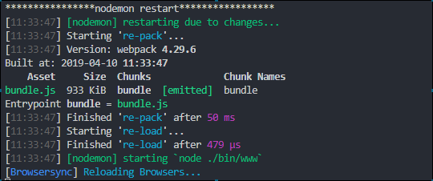

###  前后端同构实现基本原理

**前后端同构实际渲染了两次，服务端一次，主要是提前渲染出html，之后客户端还要渲染一次这样react才具备完整的生命周期，事件才会生效。(如果想要动态交互效果，使用 React 服务器端渲染，必须也配合使用浏览器端渲染。)所以index.ejs还是需要注入打包好了的bundle.js。**

----

###  后端编译react基本实现

**app.js为后端的入口文件，后端也需要处理react和es6还有css语法，所以通过start.js拦截app.js，进行处理后再导出app.js。bin下的www通过start.js启动服务。**

----

###  热更新配置

**基于gulp实现热更新，gulp.watch监听文件变化然后调用各个任务点。用到的模块有webpack-stream（用于gulp执行webpack重新打包命令）、gulp-nodemon（用于重启node服务器）、browser-sync（用于通知浏览器刷新页面）**

热更新服务器启动流程：

----

服务器更新流程：

